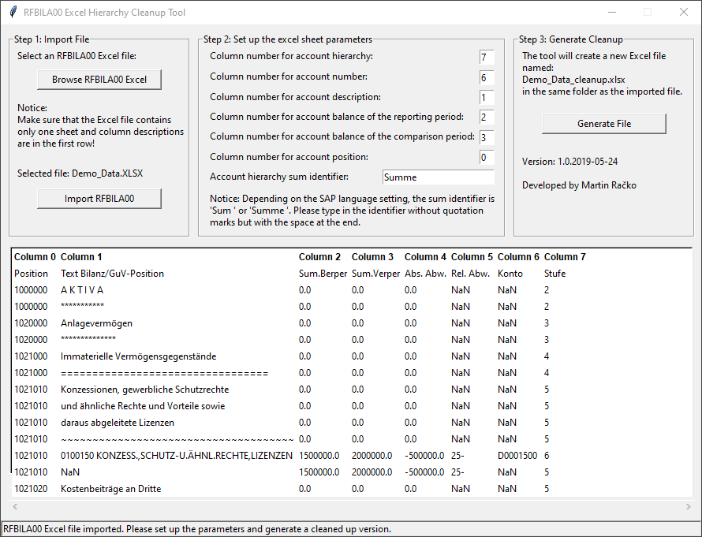
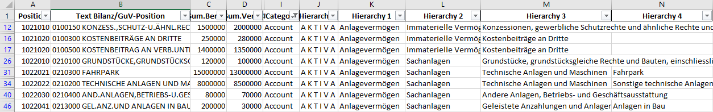

# RFBILA00-Clean-Up
The RFBILA00 Clean-Up Tool helps you transform financial statements generated in SAP using the RFBILA00 transaction for better use and data manipulation in Excel or other spreadsheets.

Financial statements generated in SAP using the transaction code RFBILA00 are generally easy to read and come in a printable form, but are unsuitable for any data manipulation in spreadsheets. With the RFBILA00 Clean-Up Tool, you can easily import SAP-generated RFBILA00 financial statements and transform them for optimal use in spreadsheets. The RFBILA00 Clean-Up Tool generates an Excel-file where each row represents a single account with all its corresponding top-level (superior) accounts as individual columns. The result will look like this:

**With the RFBILA00 Clean-Up Tool you can finally create pivot tables of SAP-generated financial statements in a couple of clicks!**

Python Package Requirements:
- Pandas
- Numpy
- tkinter
